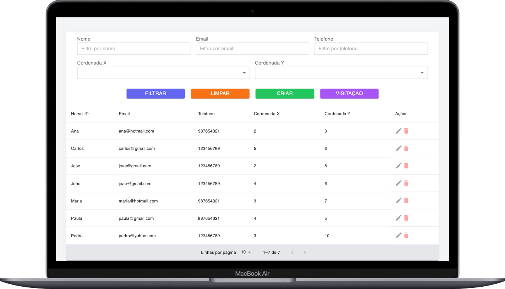
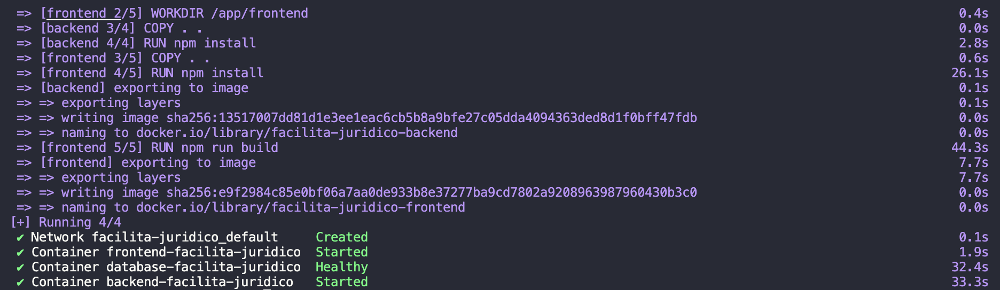

### Teste de Programação Desenvolvedor Facilita Jurídico

Este projeto foi criado como parte do teste de programação da Facilita Jurídico. A aplicação tem como objetivo gerenciar clientes e suas visitas, oferecendo funcionalidades completas para criar, editar, excluir e listar clientes, além de apresentar a ordem otimizada de visitas aos clientes.

---



---

<details>
<summary>Pré-requisitos</summary>

Antes de começar, certifique-se de ter as seguintes ferramentas instaladas no seu sistema:


| Ferramenta     | Versão | Documentação                             |
| -------------- | ------ | ---------------------------------------- |
| Docker         | 24.0.2 | [Link](https://docs.docker.com/)         |
| Docker Compose | 2.19.1 | [Link](https://docs.docker.com/compose/) |

- O Docker é usado para rodar o servidor backend, banco de dados PostgreSQL e o frontend em containers. A versão recomendada é a 24.0.2 ou superior.
- O Docker Compose é usado para gerenciar e conectar os contêineres Docker. A versão recomendada é a 2.19.1 ou superior.

Depois de garantir que todas as ferramentas estão instaladas, siga as instruções abaixo para rodar o projeto.

</details>

---

<details>
<summary>Como rodar o projeto</summary>


1. Clone o projeto:
```bash
  git clone https://github.com/onogueiradev/facilita-juridico.git
```

1. Vá para o diretório do projeto:
```bash
  cd facilita-juridico
```

1. Na raiz do projeto. Suba os containers do `docker-compose`:
```bash
  docker-compose up --build -d
```

- Este comando iniciará o backend na porta `3000`, o banco de dados na porta `5432` e o frontend na porta `3001`
- O script `init.sql` que se encontra em `/backend/initdb/init.sql` será executado automaticamente, preenchendo o banco com dados iniciais

Quando os containers estiverem prontos, você deve visualizar isso no terminal:


4. Acesse o frontend em `http://localhost:3001` e o backend em `http://localhost:3000`

5. Visualize os logs dos containers:

Estrutura dos containers:

| Nome Container             | Descrição      |
| -------------------------- | -------------- |
| database-facilita-juridico | Banco de dados |
| backend-facilita-juridico  | Backend        |
| frontend-facilita-juridico | Frontend       |

Para visualizar os logs dos containers, execute o comando:
```bash
  docker-compose logs -f
```

Para consultar os logs de um container específico, execute o comando:
```bash
  docker logs -f <container-name>
```

Para encerrar os containers, na raiz do projeto execute o comando:
```bash
  docker-compose down
```
</details>

---

<details>
<summary>Rotas do backend</summary>

Base url: `http://localhost:3000`

| Método | Rota                 | Descrição                               | Body |
| ------ | -------------------- | --------------------------------------- | ---- |
| GET    | /clients             | Retorna todos os clientes               | -    |
| POST   | /clients             | Cria um novo cliente                    | Sim  |
| PUT    | /clients/:id         | Atualiza um cliente                     | Sim  |
| DELETE | /clients/:id         | Deleta um cliente                       | -    |
| GET    | /clients/visit-order | Retorna a ordem de visitas dos clientes | -    |


`body` para criar ou atualizar um cliente

```json
{
  "nome": "nome", // string
  "email": "email", // string
  "telefone": "telefone", // string
  "coordenada_x": 0, // number
  "coordenada_y": 0, // number
}
```

### Exemplos de requisições

[GET] - `http://localhost:3000/clients`

- Retorna todos os clientes

```bash
curl -X GET 'http://localhost:3000/clients' \
  -H 'Accept: */*' \
  -H 'Content-Type: application/json'
```

[POST] - `http://localhost:3000/clients`
- Cria um novo cliente

```bash
curl -X POST 'http://localhost:3000/clients' \
  -H 'Accept: */*' \
  -H 'Content-Type: application/json' \
  -d '{
  "nome": "nome",
  "email": "email",
  "telefone": "telefone",
  "coordenada_x": 0,
  "coordenada_y": 0
}'
```

[PUT] - `http://localhost:3000/clients/:id`
- Atualiza um cliente

```bash
curl -X PUT 'http://localhost:3000/clients/1' \
  -H 'Accept: */*' \
  -H 'Content-Type: application/json' \
  -d '{
  "nome": "nome",
  "email": "email",
  "telefone": "telefone",
  "coordenada_x": 0,
  "coordenada_y": 0
}'
```

[DELETE] - `http://localhost:3000/clients/:id`

- Deleta um cliente

```bash
curl -X DELETE 'http://localhost:3000/clients/1' \
  -H 'Accept: */*' \
  -H 'Content-Type: application/json'
```

[GET] - `http://localhost:3000/clients/visit-order`

- Retorna a ordem de visitas dos clientes

```bash
curl -X GET 'http://localhost:3000/clients/visit-order' \
  -H 'Accept: */*' \
  -H 'Content-Type: application/json'
```

</details>

---

<details>
<summary>DDL Banco de dados</summary>

Este arquivo está localizado em `/backend/initdb/init.sql`

```sql
DROP TABLE IF EXISTS clientes;

CREATE TABLE IF NOT EXISTS clientes (
  id SERIAL PRIMARY KEY,
  nome VARCHAR(255) NOT NULL,
  email VARCHAR(255) NOT NULL UNIQUE,
  telefone VARCHAR(255),
  coordenada_x INTEGER,
  coordenada_y INTEGER,
  created_at TIMESTAMP DEFAULT CURRENT_TIMESTAMP,
  updated_at TIMESTAMP DEFAULT CURRENT_TIMESTAMP
);

INSERT INTO
  clientes (
    nome,
    email,
    telefone,
    coordenada_x,
    coordenada_y
  )
VALUES
  ('João', 'joao@gmail.com', '123456789', 4, 6),
  ('Maria', 'maria@hotmail.com', '987654321', 3, 7),
  ('José', 'jose@gmail.com', '123456789', 2, 8),
  ('Ana', 'ana@hotmail.com', '987654321', 2, 3),
  ('Pedro', 'pedro@yahoo.com', '123456789', 3, 10),
  ('Paula', 'paula@gmail.com', '987654321', 4, 5),
  ('Carlos', 'carlos@gmail.com', '123456789', 5, 6);
```

</details>

---

<details>
<summary>Conexão com o banco de dados</summary>

- Caso queira conectar o banco de dados em alguma interface gráfica, utilize as credenciais que estão no arquivo `.env.example` que se encontra no diretório `/backend/.env.example`

</details>

---

<details>
<summary>Informações adicionais</summary>

**Porque usei o Next ?**
- Escolhi Next.js porque é um framework React que oferece renderização do lado do servidor (SSR) e renderização do lado do cliente (CSR), o que melhora a performance e a SEO das aplicações.

**Porque usei o Zustand ?**
- Optei pelo Zustand por ser um gerenciador de estado que oferece uma API simples e fácil de usar, reduzindo a necessidade de utilizar `useContext` e `useReducer` do React. O Zustand simplifica a gestão do estado global da aplicação, facilitando a manutenção e o desenvolvimento de funcionalidades complexas com React.

**Porque usei o Material-UI ?**
- Escolhi o Material-UI por ser uma biblioteca de componentes React que oferece uma ampla variedade de componentes prontos para uso, além de ser altamente customizável e oferecer um design moderno e responsivo. O Material-UI facilita a criação de interfaces de usuário atraentes e funcionais, permitindo uma experiência de desenvolvimento mais eficiente e rápida.

**Arquitetura do backend**
- No desenvolvimento da plataforma, adotei a arquitetura MSC (Model-Service-Controller) no backend para garantir uma separação clara entre as camadas de dados, lógica de negócios e interface com o usuário. Isso proporcionou um código mais organizado e de fácil manutenção.

**Algoritmo de visitação dos clientes**
- Para a lógica de visitação dos clientes, utilizei o algoritmo nearestNeighbor (Vizinho mais próximo), que determina a ordem mais eficiente para visitar todos os clientes em um mapa bidimensional. Esse algoritmo garante que o percurso seja feito de forma otimizada, visitando os clientes mais próximos primeiro.

</details>

---

<details>
<summary>Apresentação</summary>

Para visualizar a apresentação do projeto, acesse o link abaixo:
- [Vídeo de apresentação](https://youtu.be/24NM97AWXhs?si=8BxEj6L597u9kX5V)

</details>

---

⭐️ Este README foi gerado com o [Code Mark](https://codemark.com.br/). Um gerador de README simples e eficiente.